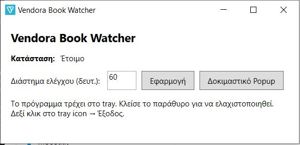

# Vendora.gr Book Watcher

Εφαρμογή desktop που παρακολουθεί τις τιμές βιβλίων στην ιστοσελίδα **Vendora.gr** και ειδοποιεί τον χρήστη όταν εντοπίζεται νέα καταχώρηση ή αλλαγή τιμής.

## 🔧 Τεχνολογίες

- Γλώσσα προγραμματισμού: C#
- Πλατφόρμα: .NET Framework
- Γραφικό περιβάλλον: WPF (Windows Presentation Foundation)
- Διαχείριση έργου: Visual Studio

## 🚀 Οδηγίες Εγκατάστασης

1. Κλωνοποιήστε το repository:

git clone https://github.com/abatsakidis/Vendora.gr-Book-Watcher.git

2. Ανοίξτε το έργο στο Visual Studio.
3. Εκτελέστε την εφαρμογή πατώντας το κουμπί "Start".

## ⚙️ Χρήση

1. Ορίστε το χρονικό διάστημα παρακολούθησης (σε λεπτά ή ώρες) μέσα στην εφαρμογή.
2. Η εφαρμογή θα ελέγχει την ιστοσελίδα **Vendora.gr** σε τακτά χρονικά διαστήματα για νέες καταχωρήσεις βιβλίων.
3. Όταν εντοπιστούν νέα βιβλία, θα εμφανιστούν στην εφαρμογή μαζί με τις τρέχουσες τιμές και την αρχική εικόνα του βιβλίου.
4. Η εφαρμογή ειδοποιεί τον χρήστη για κάθε νέα καταχώρηση.

## 🛠️ Δομή Αρχείων

- `App.xaml` / `App.xaml.cs`: Αρχείο εκκίνησης της εφαρμογής.
- `MainWindow.xaml` / `MainWindow.xaml.cs`: Κύριο παράθυρο της εφαρμογής.
- `PopupWindow.xaml` / `PopupWindow.xaml.cs`: Παράθυρο ειδοποίησης.
- `VendoraBookWatcher.csproj`: Αρχείο έργου του Visual Studio.
- Φάκελοι:
  - `Models`: Μοντέλα δεδομένων.
  - `Properties`: Ρυθμίσεις έργου.
  - `Services`: Υπηρεσίες για επικοινωνία με την ιστοσελίδα.
  - `obj`, `bin`: Αρχεία μεταγλώττισης.
  
## 📄 Screenshots

## 📄 Άδεια Χρήσης

Αυτό το έργο διατίθεται υπό την άδεια MIT.
